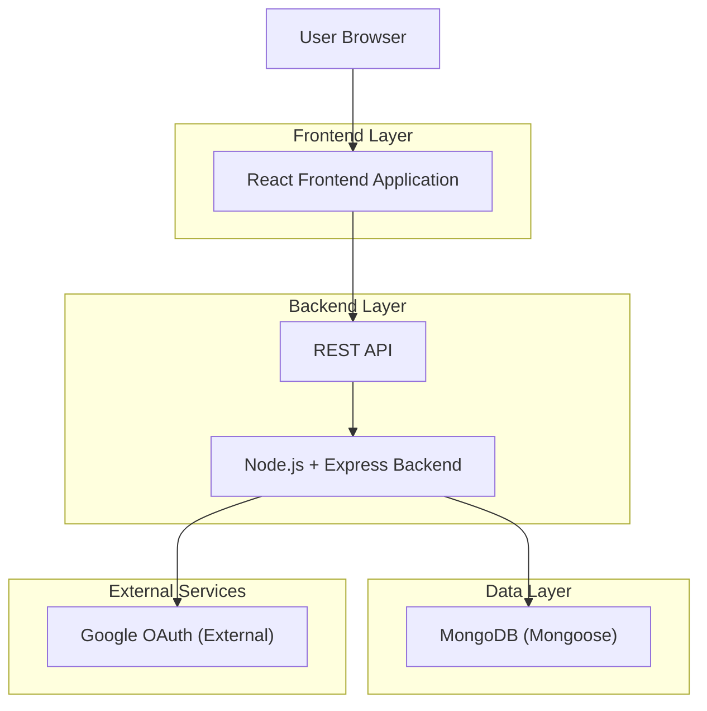
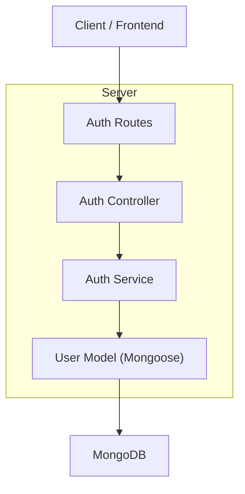
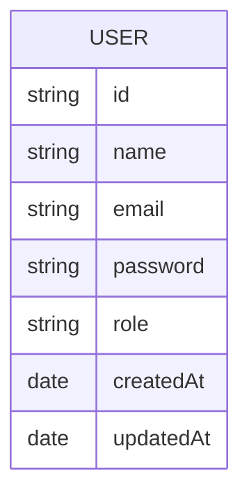

## 1.Architecture design


## 2.Technology Description
- Frontend: React@18 + react-router-dom + tailwindcss@3 + vite
- Backend: Node.js + Express@4
- Database: MongoDB + mongoose

## 3.Route definitions
| Route | Purpose |
|-------|---------|
| /login | Pantalla de login (mockup) con email/contraseña y botón Google |
| /register | Pantalla de registro (destino del link secundario) |
| / | Entrada post-login (cliente) |
| /admin | Entrada post-login (admin) |

## 4.API definitions (If it includes backend services)
### 4.1 Core API
Autenticación por credenciales
```
POST /auth/login
```
Request:
| Param Name| Param Type | isRequired | Description |
|----------|------------|------------|-------------|
| email | string | true | Email del usuario |
| password | string | true | Contraseña |

Response:
| Param Name| Param Type | Description |
|----------|------------|-------------|
| token | string | JWT o token de sesión |
| user | User | Usuario autenticado |

Validación de sesión
```
GET /auth/me
```
Headers: Authorization (token)

OAuth con Google (si se habilita el botón Google)
```
GET /auth/google
GET /auth/google/callback
```

TypeScript types (compartidos a nivel de contrato)
```ts
export type UserRole = "customer" | "admin";

export type User = {
  id: string;
  name: string;
  email: string;
  role: UserRole;
};

export type AuthResponse = {
  token: string;
  user: User;
};
```

## 5.Server architecture diagram (If it includes backend services)


## 6.Data model(if applicable)
### 6.1 Data model definition


### 6.2 Data Definition Language
No aplica SQL (MongoDB). El modelo se define vía Mongoose Schema en la colección `users`, con `email` como único y `role` en {customer, admin}.
