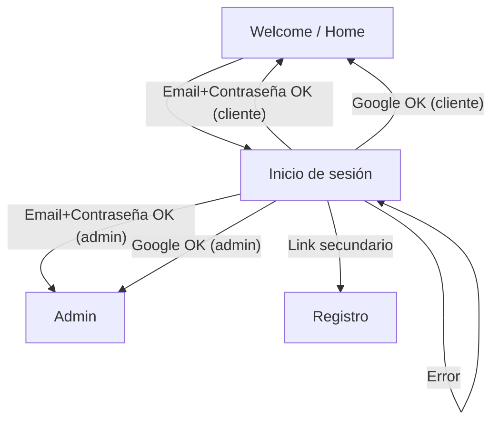

## 1. Product Overview
Pantalla de inicio de sesión (ITUKA) que replica **exactamente** el mockup.
Incluye logo superior, formulario email/contraseña, CTA principal, link secundario, divisor, botón Google y footer; **sin animaciones**.

## 2. Core Features

### 2.1 User Roles
| Rol | Método de acceso | Permisos principales |
|------|------------------|----------------------|
| Cliente | Email + contraseña / Google | Accede a la app como usuario estándar |
| Admin | Email + contraseña / Google | Accede a secciones de administración |

### 2.2 Feature Module
1. **Inicio de sesión**: logo, formulario (email/contraseña), botón principal, link secundario, divisor, botón Google, footer.

### 2.3 Page Details
| Page Name | Module Name | Feature description |
|-----------|-------------|---------------------|
| Inicio de sesión | Encabezado (logo) | Mostrar el logo centrado en la parte superior, con tamaño/espaciado idéntico al mockup. |
| Inicio de sesión | Formulario: Email | Capturar email con input y label; validar requerido y formato email; mostrar error si corresponde. |
| Inicio de sesión | Formulario: Contraseña | Capturar contraseña con input tipo password y label; validar requerido; permitir enviar con Enter. |
| Inicio de sesión | Botón principal | Enviar credenciales; mostrar estado “cargando” y bloquear doble envío mientras dura la solicitud. |
| Inicio de sesión | Link secundario | Navegar a la ruta existente de registro (p. ej. “Regístrate”) según el mockup. |
| Inicio de sesión | Divisor | Separar visualmente el acceso por credenciales y el acceso con Google, tal como en el mockup. |
| Inicio de sesión | Botón Google | Iniciar sesión con Google (CTA secundario), con el texto/ícono/estilo del mockup. |
| Inicio de sesión | Mensajes de error | Mostrar error de autenticación de forma clara y consistente con el diseño (sin animaciones). |
| Inicio de sesión | Footer | Mostrar texto de footer (p. ej. legal/copyright) alineado/espaciado idéntico al mockup. |
| Inicio de sesión | Reglas “sin animación” | No usar animaciones ni transiciones (CSS/JS). Los cambios de estado deben ser instantáneos. |

## 3. Core Process
Flujo de usuario (Cliente/Admin):
1) Abres la página de login.
2) Ingresas email y contraseña y pulsas “Iniciar sesión”.
3) Si las credenciales son válidas, accedes a la app (cliente) o al área admin (admin).
4) Alternativamente, pulsas “Continuar con Google” y completas el flujo de autenticación.
5) Si hay error, se muestra un mensaje y permaneces en login.

